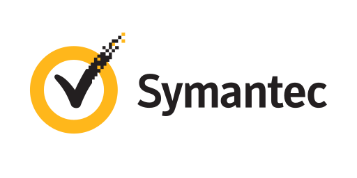
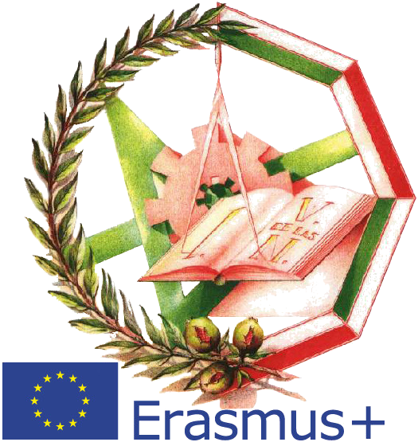
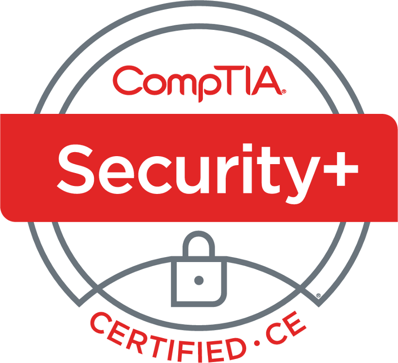
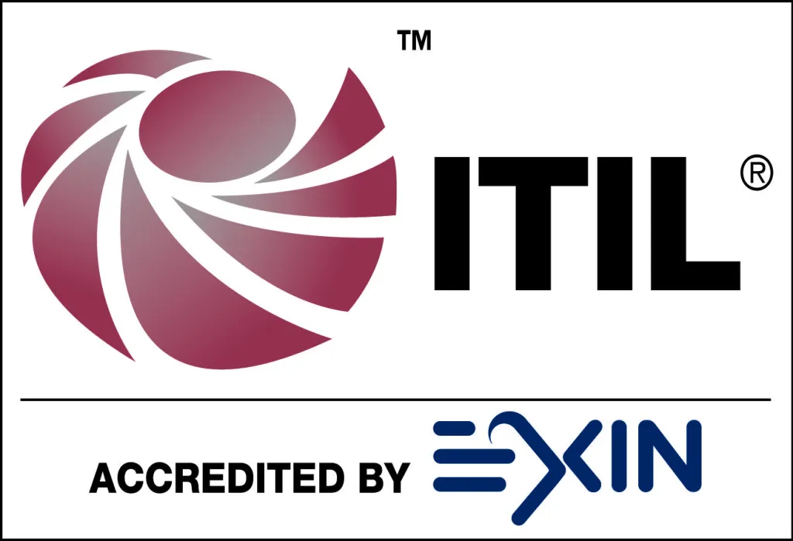
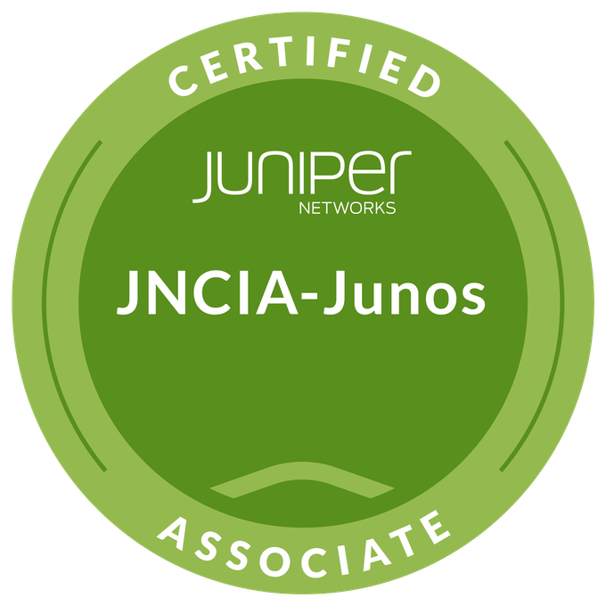

+++
title = "Curriculum Vitae"
date = 2026-03-12T19:24:06-04:00
lastmod = 2026-05-08
draft = false 
showAuthor = true
+++

## Professional Experience  
<table>
    <thead>
        <tr>
            <th>Company</th>
            <th>Website</th>
            <th>Position</th>
            <th>Dates</th>
            <th>Location</th>
        </tr>
    </thead>
    <tbody>
        <tr>
            <td rowspan=4></td>
            <td rowspan=4><a href="https://secureops.com/" target="_blank">SecureOps</a></td>
        </tr>
           <tr>
            <td>Manager of Infrastructure Support</td>
            <td>2021 - 2025</td>
            <td rowspan=2>Montreal, CAN</td>
        </tr>
        <tr>
            <td>Network Secrurity Team Lead</td>
            <td>2020 -  2021</td>
         </tr>
        <tr>
            <td>Network Security Engineer and Team Lead</td>
            <td>2018 - 2019</td>
            <td>Prague,  CZE</td>
        <tr>
            <td></td>
            <td><a href="https://www.broadcom.com/products/cybersecurity" target="_blank">Symantec</a></td>
            <td>Technical Support Engineer</td>
            <td>2016 - 2017</td>
            <td>Prague,  CZE</td>
        </tr>
         <tr>
            <td rowspan=4></td>
            <td rowspan=4><a href="https://www.att.com/" target="_blank">AT&T</a></td>
        </tr>
        <tr>
            <td>Network Operations Team Leader</td>
            <td>2013 -  2016</td>
            <td rowspan=3>Brno,  CZE</td>
        </tr>
        <tr>
            <td>Network Specialist</td>
            <td>2012 -  2013</td>
         </tr>
        <tr>
            <td>Network Analyst</td>
            <td>2010 -  2012</td>
        </tr>
           <tr>
            <td></td>
            <td><a href="https://www.crunchbase.com/organization/nostracom-telecomunicaciones target="_blank">Nostracom Telecomunicaciones</a></td>
            <td>Network Field Technician</td>
            <td>2007 - 2008</td>
            <td>Granada, ESP</td>
        </tr> 
    </tbody>
</table>

## Academic Education
<table>
    <thead>
        <tr>
            <th>School</th>
            <th>Website</th>
            <th>Degree</th>
            <th>Date</th>
        </tr>
    </thead>
    <tbody>
        <tr>
            <td></td>
            <td><a href="https://www.york.ac.uk/" target="_blank">University of York, United Kingdom</a></td>
            <td>MSc in Computer Sceince with Cyber Security</td>
            <td>2022</td>
        </tr>
        <tr>
            <td></td>
            <td><a href="https://www.london.ac.uk" target="_blank">The London School of Economics and Political Science, United Kingdom</a></td>
            <td>BSc in Information Systems and Management</td>
            <td>2019</td>
        </tr>
        <tr>
            <td></td>
            <td><a href="https://virgendelasnieves.es/" target="_blank">I.E.S. Virgen de las Nieves, Spain</a></td>
            <td>Advanced Diploma in Telecommunications and Information Technology Systems   </td>
            <td>2006</td>
        </tr>
    </tbody>
</table>

## [Certifications](https://www.credly.com/users/carlos-retamero-diaz.638bf66b) 

Check my certifications on [Credly](https://www.credly.com/users/carlos-retamero-diaz.638bf66b). 

<table>
    <thead>
        <tr>
            <th>Vendor</th>
            <th>Certificate</th>
            <th>Date</th>
        </tr>
    </thead>
    <tbody>
        <tr>
            <td ></td>
           <td>ISO/IEC 27001 Lead Auditor</td>
           <td>WIP</td>   
        </tr>
            <td ></td>  
           <td>Certified Information System Security Professional (CISSP)</td>
            <td>2026</td>   
        </tr>
         <tr>
            <td ></td> 
           <td>Palo Alto Networks Accredited Systems Engineer (PSE): Foundation Accreditation Exam</td>
            <td >2020</td>   
        </tr>
         <tr>
            <td ></td>   
           <td>CompTIA Security+ (SY0-701)</td>
            <td >2017</td>   
        </tr>
      <tr>
            <td rowspan=3></td>
        </tr>
        <tr>
            <td>Blue Coat Certified PacketShaper Professional</td>
            <td>2016</td>   
        </tr>
            <td>Blue Coat Certified PacketShaper Administrator</td>
            <td>2016</td>
        </tr>
        <tr>
            <td></td> 
           <td>ITIL® 3: Foundation Certificate in IT Service Management</td>
            <td >2014</td>   
          <tr>
            <td></td>
            <td>Juniper Networks Certified Associate (JNCIA-Junos)</td>
            <td>2013</td>  
        </tr>
        <tr>
            <td rowspan=5><a href="https://www.cisco.com/" target="_blank"></td></a>
        </tr>
        <tr>
            <td>Cisco Certified Networking Professional Service Provider (CCNP - 642)</td>
            <td >2015</td>   
        </tr>
        <tr>
            <td>Cisco Certified Networking Professional Routing & Switching (CCNP - 642)</td>
            <td >2012</td>   
        </tr>
        <tr>
            <td>Cisco Certified Networking Associate Routing & Switching (CCNA - 640)</td>
            <td >2009</td>   
        </tr>
        <tr>    
            <td>Cisco Certified Entry Networking Technician (CCENT - 640)</td>
             <td>2009</td>
         </tr>
           <tr>
            <td ></td>   
           <td>Microsoft Certified Systems Engineer Windows Server 2003</td>
            <td >2010</td>   
        </tr>
    </tbody>
</table>

---
