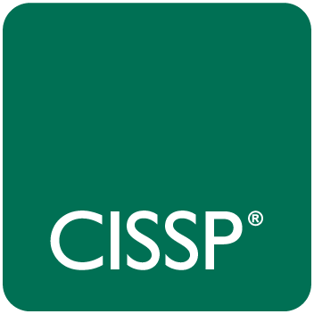
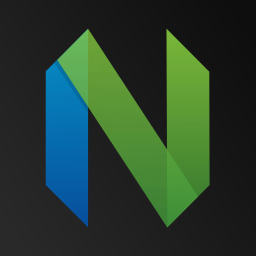
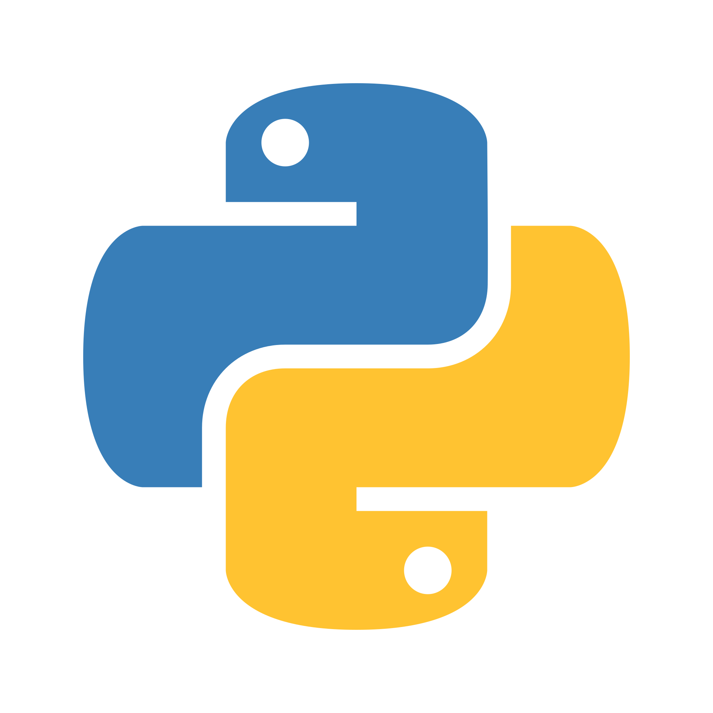
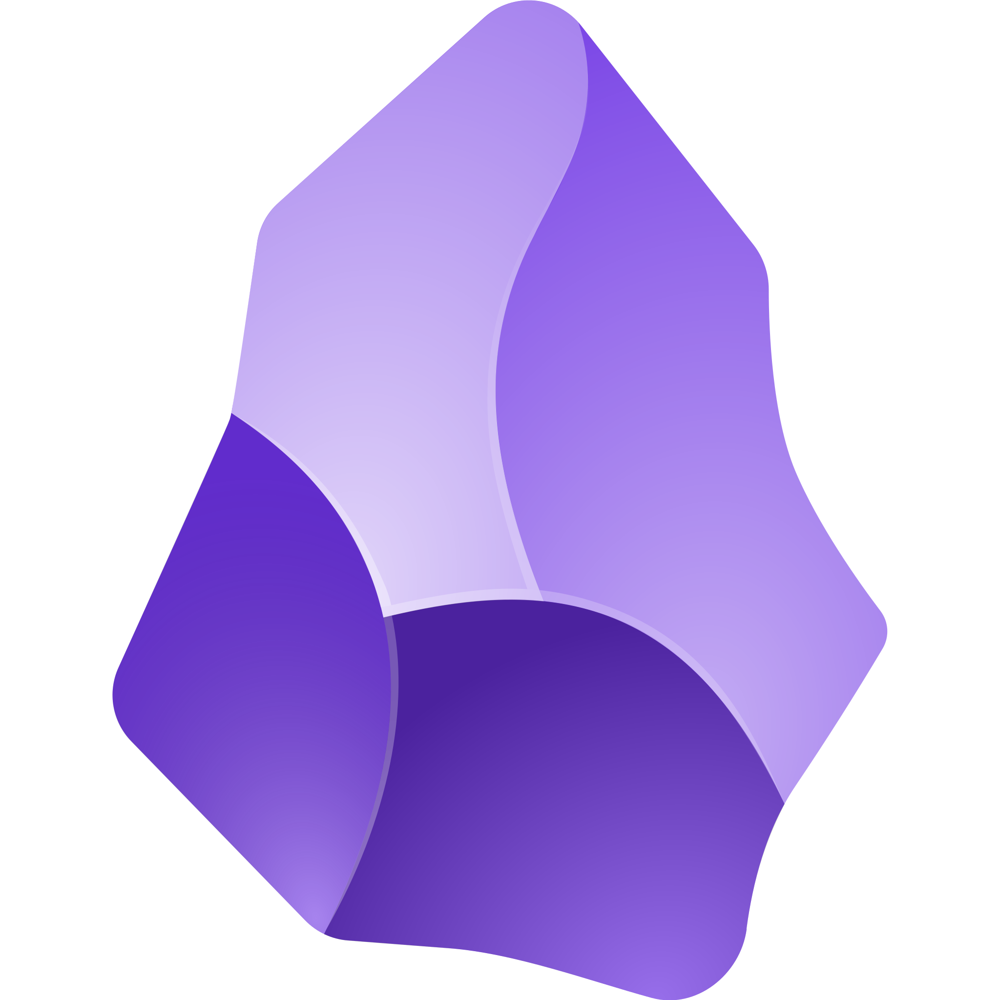
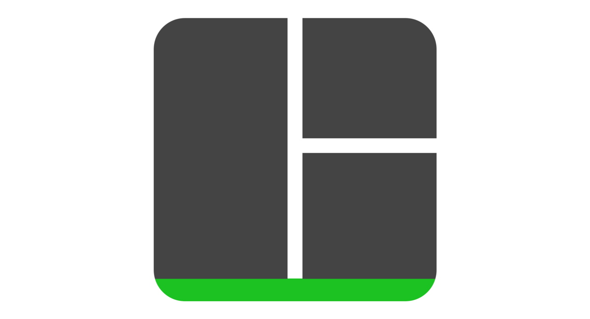
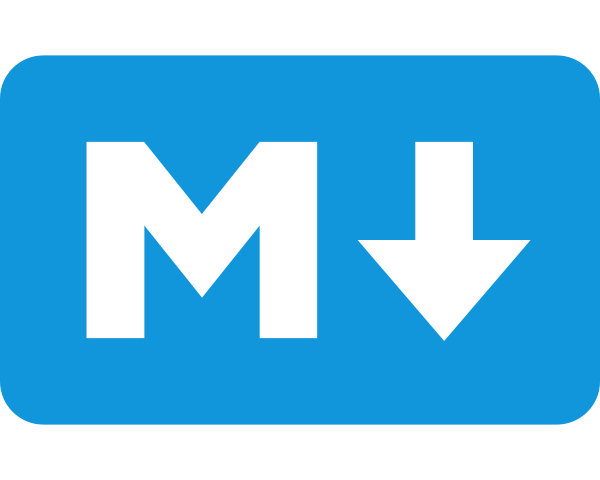
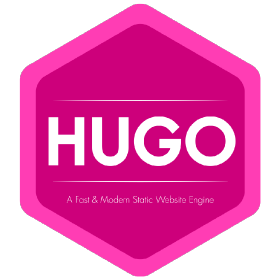
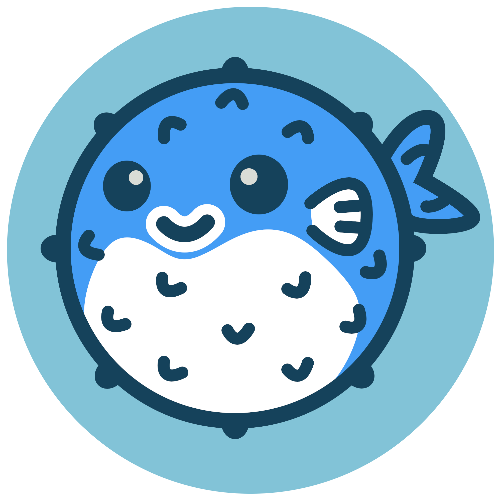
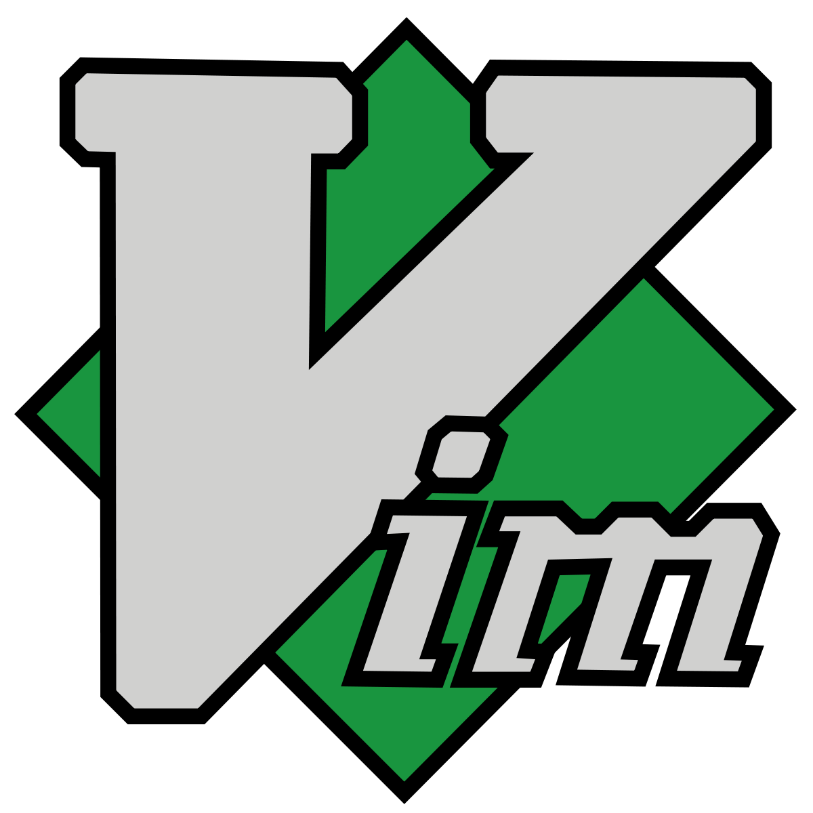

This is a list of technologies and tools I’m currently trying to learn and the reasons why I choose to do so: 

## 2026 
<table>
    <thead>
        <tr>
            <th>Technology</th>
            <th>Website</th>
            <th>Description</th>
        </tr>
    </thead>
    <tbody>
         <tr>
            <td></td>
            <td><a target="_blank" href="https://www.isc2.org/certifications/cissp/">ICS2 CISSP</a></td>
            <td>This is the year I get CISSP certified. I promise!</td>
        </tr>
           <tr>
            <td></td>
            <td><a target="_blank" href="https://neovim.io/">Neovim</a></td>
            <td>Installed <a target"_blank" href="https://www.lazyvim.org/">Lazyvim</a> because I'm lazy and I don't want to spend an eteternity fighting with LUA</td>
        <!-- 
        </tr>
            <tr>
            <td></td>
            <td><a target="_blank" href="https://www.python.org/">Python</a></td>
            <td>I'm ready to delve into the world of automating spreadsheets and reports.</td>
        </tr>-->
         <tr>
            <td></td>
            <td><a target="_blank" href="https://obsidian.md/"> Obsidian </a></td>
            <td>I plan on taking smart notes to create a second brain that hopefully functions better than mine.</td>
        </tr>
        <tr>
            <td></td>
            <td><a target="_blank" href="https://github.com/tmux/tmux/wiki/"> tmux </a></td>
            <td>Let me experience persistence of time inside the CLI.</td>
        </tr>
        <tr>
            <td></td>
            <td><a target="_blank" href="https://swaywm.org/"> Sway</a></td>
            <td>I tried I3 in the past with relative success. I've deviced to install Fedora Sway this year and rice it a little bit.</td>
        </tr>
    </tbody>
</table>

## 2023 

<table>
    <thead>
        <tr>
            <th>Technology</th>
            <th>Website</th>
            <th>Description</th>
        </tr>
    </thead>
    <tbody>
            <tr>
            <td></td>
            <td><a target="_blank" href="https://www.markdownguide.org">Markdown </a></td>
            <td>Markup language to create technical documentation. Will come handy while working on this website and later with Obsidian.</td>
        </tr>
            <tr>
            <td></td>
            <td><a target="_blank" href="https://gohugo.io/">Hugo</a></td>
            <td>The building blocks of this website. Because wordpress is so mainstream....</td>
        </tr>
            <tr>
            <td></td>
            <td><a target="_blank" href="https://github.com/nunocoracao/blowfish">Blowfish</a></td>
            <td>A theme for Hugo that makes this website look the way it does.</td>
        </tr>
            <tr>
            <td></td>
            <td><a target="_blank" href="https://github.com/">Github</a></td>
            <td>Because learning version control and collaborative tools is a good thing for those who work with other human beings. </td>
        </tr>
            <tr>
            <td></td>
            <td><a target="_blank" href="https://www.vim.org/">Vim</a></td>
            <td>Because I want to tell people Vim is my editor of choice. Will I ever quit using the mouse or die trying?.</td>
        </tr>
    </tbody>
</table>
<table>
    </tbody>
</table>
