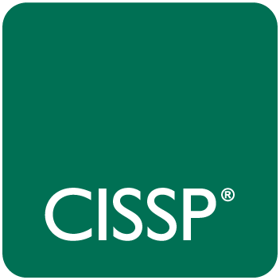
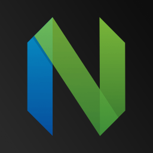
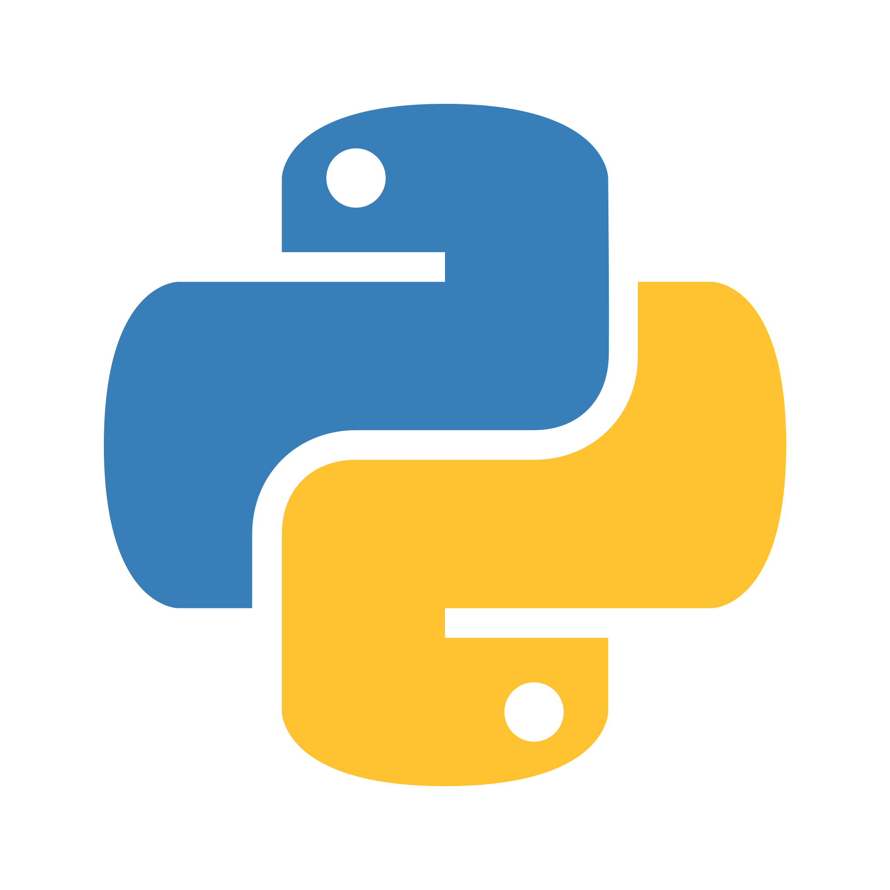
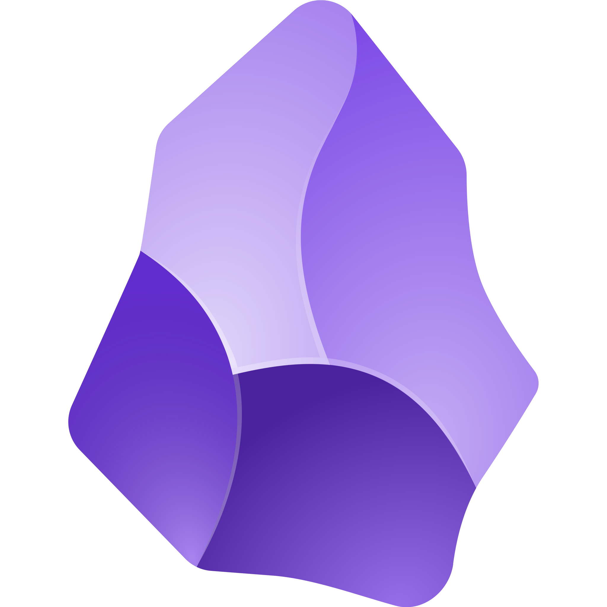
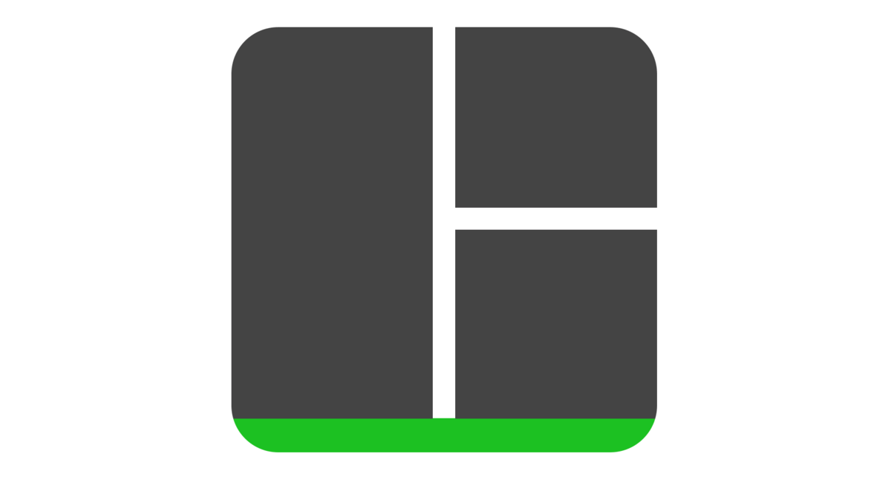
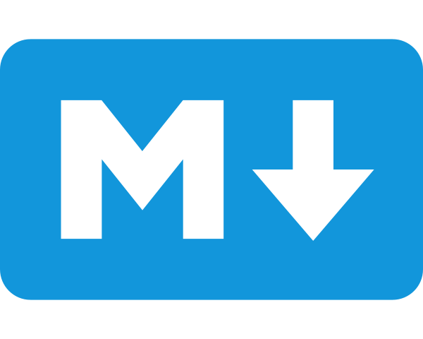
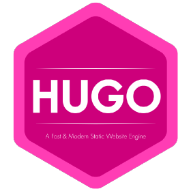
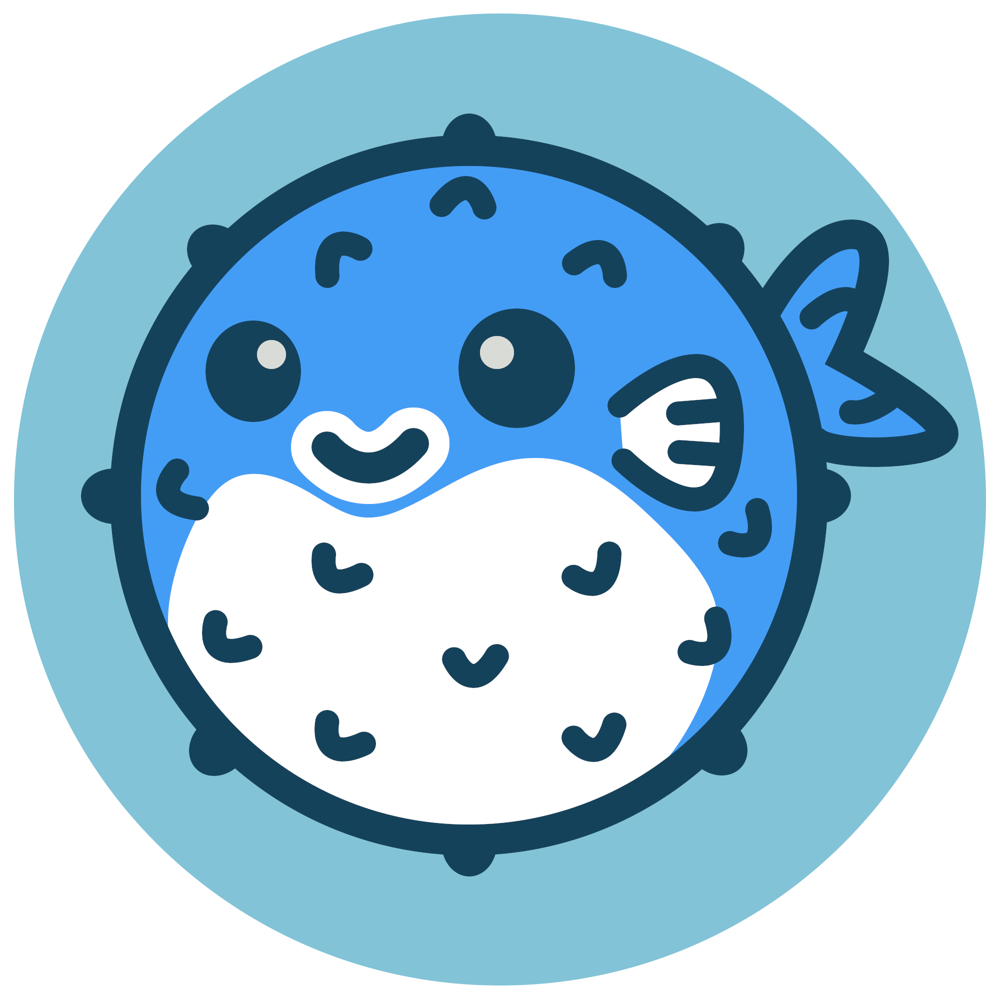
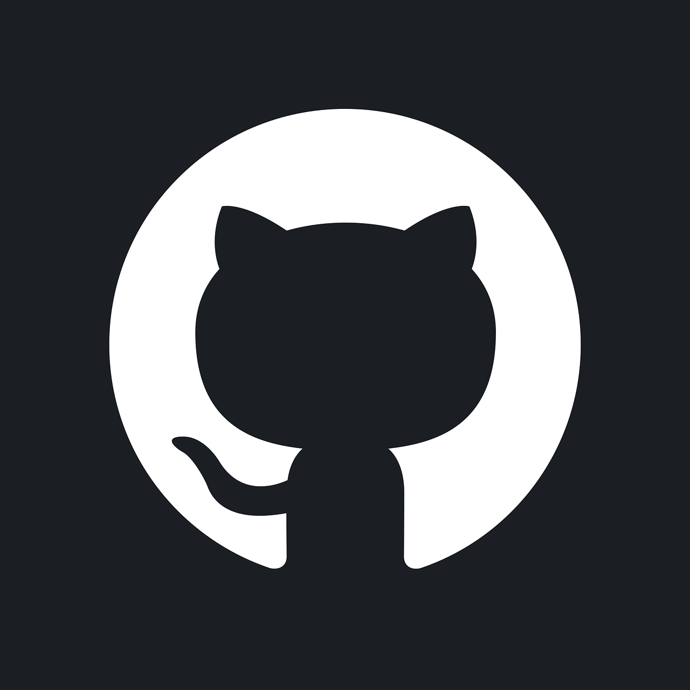
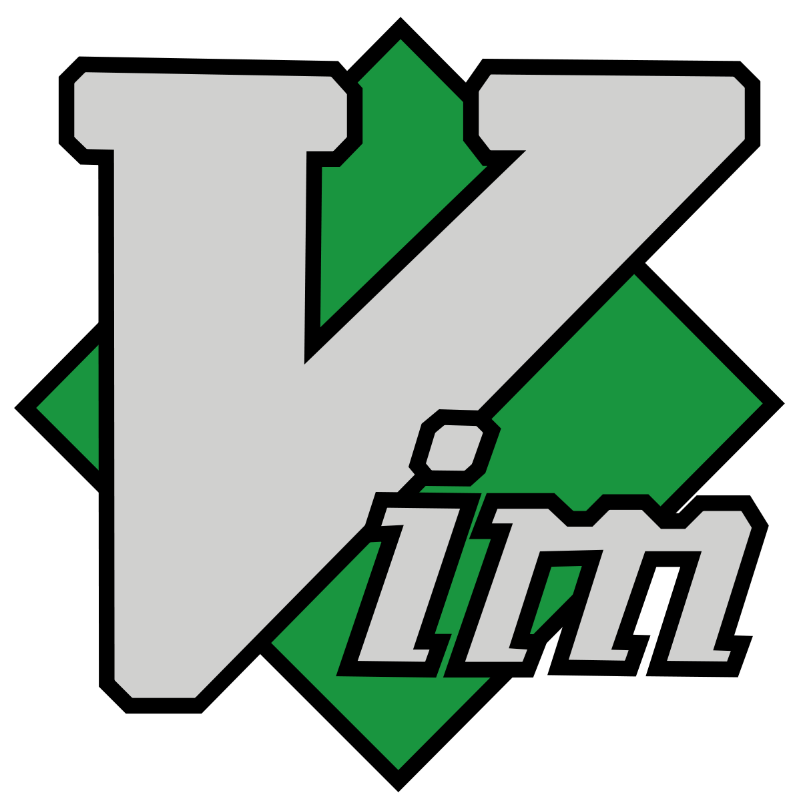

This is a living document to track the things I’m working on:

## Blog Backlog

- Rewrite tables on Roadmap and [CV section](/cv/index.md)
- Create a blog roadmap 

## Currently Tinkering With

<table>
    <thead>
        <tr>
            <th>Focus Area</th>
            <th>Action Plan</th>
        </tr>
    </thead>
    <tbody>
         <tr>
            <td></td>
            <td>This is the year I <s>get CISSP certified. I promise!</s> got the CISSP, as promised.</td>
        </tr>
           <tr>
            <td></td>
            <td>Installed <a target"_blank" href="https://www.lazyvim.org/">Lazyvim</a> because I'm lazy and I don't want to spend an eteternity fighting with LUA</td>
        <!-- 
        </tr>
            <tr>
            <td></td>
            <td><a target="_blank" href="https://www.python.org/">Python</a></td>
            <td>I'm ready to delve into the world of automating spreadsheets and reports.</td>
        </tr>-->
         <tr>
            <td></td>
            <td>I plan on taking smart notes to create a second brain that hopefully functions better than mine.</td>
        </tr>
        <tr>
            <td></td>
            <td>Let me experience persistence of time inside the CLI.</td>
        </tr>
        <tr>
            <td></td>
            <td>I tried I3 in the past with relative success. I've deviced to install Fedora Sway this year and rice it a little bit.</td>
        </tr>
    </tbody>
</table>

## 2023

<table>
    <thead>
        <tr>
            <th>Focus Area</th>
            <th>Action Plan</th>
        </tr>
    </thead>
    <tbody>
            <tr>
            <td></td>
            <td>Markup language to create technical documentation. Will come handy while working on this website and later with Obsidian.</td>
        </tr>
            <tr>
            <td></td>
            <td>The building blocks of this website. Because wordpress is so mainstream....</td>
        </tr>
            <tr>
            <td></td>
            <td>A theme for Hugo that makes this website look the way it does.</td>
        </tr>
            <tr>
            <td></td>
            <td>Because learning version control and collaborative tools is a good thing for those who work with other human beings. </td>
        </tr>
            <tr>
            <td></td>
            <td>Because I want to tell people Vim is my editor of choice. Will I ever quit using the mouse or die trying?.</td>
        </tr>
    </tbody>
</table>
<table>
    </tbody>
</table>
