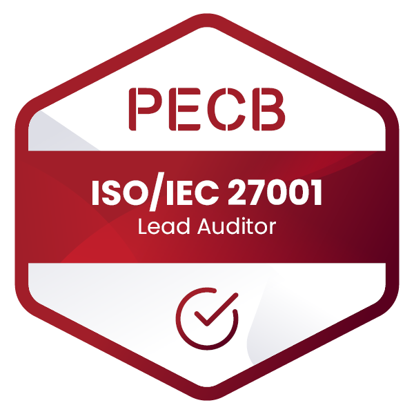

This is a living document to keep track of the things I’m currently working on:

## Currently Tinkering With

| Focus Area | Action Plan |
| :--- | :--- |
|  |  **PECB ISO/IEC 27001 Lead Auditor:** In a attempt to improve my knowledge on Governance, Risk and Compliance, I've decided to pursue the ISO 27001 Lead Auditor certification. |
|  |  **ISC2 CISSP Certification  :** This is the year <s> I will get CISSP certified. I promise!</s> I got the CISSP certification from ISC2 as promised. Check the [CISSP]({}) series to read about my strategy and materials for passing the exam.|
| | **Fedora Atomic Sway:** I keep going back and forth between macOS and Linux. I've tried I3 in the past with relative success, so this year I deviced to install [Fedora Sway](/posts/260320_deploying_fedora_sway/index.md) and rice it a little bit. I enjoy having my T480S as my daily driver. |
| | **Tmux:** As part of improving my workflow, I decided to force myself to use the CLI as much as possible. [Terminal Multiplexer](https://tmuxcheatsheet.com/) allows me to experience the "persistence of time" inside the CLI. [Some people](https://medium.com/unixification/tmux-transformed-how-i-use-my-terminal-6fe272e0f69c) even use it as s window manager.|
|  | **Vim:** The last piece on the workflow puzzle. If it works for [The Primeagen](https://www.youtube.com/watch?v=bdumjiHabhQ), it should be good enough for me. I installed [Lazyvim](https://www.lazyvim.org/) because learning Vim is already hard enough without spending an eternity fighting with LUA. I plan on using LazyVim as my main editor to work on this website.|
|  | **Obsidian:** During my CISSP studies, I started taking smart notes, Zettelkasten-ish if you will, to build a second brain, with the hope that it stores information better than mine does. Still a bit rough around the edges, but I think there's real potential in connecting ideas and helping with my writing. |
|  | **Markup language:** The glue that holds technical documentation together. It's certainly coming in handy while working on this website and in Obsidian.|
|| **Hugo and Blowfish:** The building blocks of this website. Because WordPress is so mainstream… Blowfish is the theme that makes this website look the way it does.|
||**Lazygit:** Because learning version control and collaborative tools is a good thing for those who work with other human beings. All without leaving the CLI!!!|

## Blog Backlog

- Write post about:
  - Finish writting Fedora Sway post
  - Minimalism
  - PECB ISO 27001 Lead Auditor
- Add copy buttom to code blocks
- Add currently reading section 
- Rewrite tables on Roadmap and [CV section](/cv/index.md) 
- Create a blog roadmap 

## Currently Reading

- Level One: The Complete Course by Reid Duke
- The Richest Man in Babylon by George Samuel Clason
- Switch On Your Brain: The Key to Peak Happiness, Thinking, and Health by Caroline Leaf 
- CISSP: The Last Mile by Pete Zerger 
- ISC2 CISSP Certified Information Systems Security Professional Official Study Guide by Mike Chapple, James Michael Stewart, Darril Gibson 
- The subtle art of not giving a fuck by Mark Manson 

