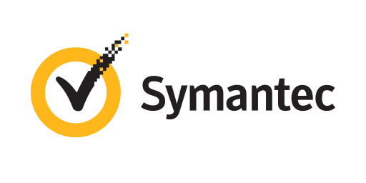
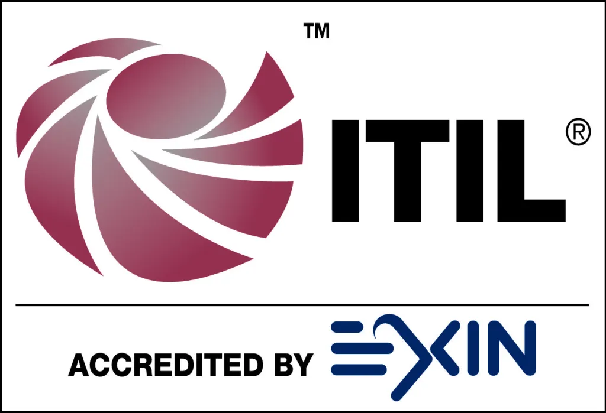

+++
title = "About"
date = 2023-08-30T22:14:06-04:00
draft = false 

showDate = true
showDateUpdated = true
showHeadingAnchors = false
showPagination = false
showReadingTime = true
showTableOfContents = true
showTaxonomies = false 
showWordCount = false
showSummary = false
sharingLinks = false
showEdit = false
showViews = true
showLikes = false
layoutBackgroundHeaderSpace = false
+++
## About 

---

## Professional Experience  
<table>
    <thead>
        <tr>
            <th>Company</th>
            <th>Website</th>
            <th>Position</th>
            <th>Dates</th>
            <th>Location</th>
        </tr>
    </thead>
    <tbody>
        <tr>
            <td rowspan=4></td>
            <td rowspan=4><a href="https://secureops.com/" target="_blank">SecureOps</a></td>
        </tr>
           <tr>
            <td>Manager of Infrastructure Support</td>
            <td>2021 - Present</td>
             <td rowspan=2>Montreal, CAN</td>
        </tr>
        <tr>
            <td>Network Secrurity Team Lead</td>
            <td>2018 - 2021</td>
         </tr>
        <tr>
            <td>Network Security Engineer</td>
            <td>2017 - 2018</td>
             <td>Prague,  CZE</td>
        <tr>
            <td></td>
            <td><a href="https://www.broadcom.com/products/cybersecurity" target="_blank">Symantec</a></td>
            <td>Technical Support Engineer</td>
            <td>2016 - 2017</td>
            <td>Prague, CZE</td>
        </tr>
         <tr>
            <td rowspan=4></td>
            <td rowspan=4><a href="https://www.att.com/" target="_blank">AT&T</a></td>
        </tr>
        <tr>
            <td>Network Operations Team Leader</td>
            <td>2013 - 2016</td>
             <td rowspan=3>Brno,  CZE</td>
        </tr>
        <tr>
            <td>Network Specialist</td>
            <td>2012 - 2013</td>
         </tr>
        <tr>
            <td>Network Analyst</td>
            <td>2010 - 2012</td>
        </tr>
           <tr>
            <td></td>
            <td><a href="https://www.crunchbase.com/organization/nostracom-telecomunicaciones target="_blank">Nostracom Telecomunicaciones</a></td>
            <td>Network Field Technician</td>
            <td>2007 - 2008</td>
            <td>Granada, ESP</td>
        </tr> 
    </tbody>
</table>

## Academic Education
<table>
    <thead>
        <tr>
            <th>School</th>
            <th>Website</th>
            <th>Degree</th>
            <th>Date</th>
        </tr>
    </thead>
    <tbody>
        <tr>
            <td></td>
            <td><a href="https://www.york.ac.uk/" target="_blank">University of York, United Kingdom</a></td>
            <td>MSc in Computer Sceince with Cyber Security</td>
            <td>2022</td>
        </tr>
        <tr>
            <td></td>
            <td><a href="https://www.london.ac.uk" target="_blank">The London School of Economics and Political Science, United Kingdom</a></td>
            <td>BSc in Information Systems and Management</td>
            <td>2019</td>
        </tr>
    </tbody>
</table>

## Certifications 

<table>
    <thead>
        <tr>
            <th>Vendor</th>
            <th>Website</th>
            <th>Certificate</th>
            <th>Certificate #</th>
            <th>Date</th>
        </tr>
    </thead>
    <tbody>
        <tr>
            <td ></td>
            <td ><a href="https://www.isc2.org/certifications/cissp/" target="_blank">ICS2</a></td>   
           <td>Certified Information System Security Professional (CISSP)</td>
            <td></td>
            <td >WIP</td>   
        </tr>
         <tr>
            <td ></td>
            <td ><a href="hhttps://www.comptia.org/" target="_blank">CompTIA</a></td>   
           <td>CompTIA Security+ (SY0-601)</td>
            <td>COMP001021087384</td>
            <td >2017</td>   
        </tr>
        <tr>
            <td></td>
            <td><a href="https://www.axelos.com/certifications/itil-service-management" target="_blank">Axelos</a></td>   
           <td>ITIL® 3: Foundation Certificate in IT Service Management</td>
            <td>5159572.20319561</td>
            <td >2014</td>   
        </tr>  
    </tbody>
</table>

## Past Certifications 

<table>
    <thead>
        <tr>
            <th>Vendor</th>
            <th>Website</th>
            <th>Certificate</th>
            <th>Certificate #</th>
            <th>Date</th>
        </tr>
    </thead>
    <tbody>
           <tr>
            <td ></td>
            <td ><a href="https://www.paloaltonetworks.com/ target="_blank">Palo Alto Networks</a></td>   
           <td>Palo Alto Networks Accredited Systems Engineer (PSE): Foundation Accreditation Exam</td>
            <td></td>
            <td >2020</td>   
        </tr>
      <tr>
            <td rowspan=3></td>
            <td rowspan=3><a href="https://www.broadcom.com/products/cybersecurity" target="_blank">Blue Coat Systems</a></td>   
        </tr>
        <tr>
            <td>Blue Coat Certified PacketShaper Professional</td>
            <td>BCPSP-5.0.1-43327</td>
            <td rowspan=2>2016</td>   
        </tr>
        <tr>
            <td>Blue Coat Certified PacketShaper Administrator</td>
            <td>BCPSA-5.0.1-43319</td>
        </tr>
        <tr>
            <td rowspan=5></td>
            <td rowspan=5><a href="https://www.cisco.com/" target="_blank">Cisco Systems</a></td>   
        </tr>
        <tr>
            <td>Cisco Certified Networking Professional Service Provider (CCNP - 642)</td>
            <td>CSO11614597</td>
            <td >2015</td>   
        </tr>
        <tr>
            <td>Cisco Certified Networking Professional Routing and Switching (CCNP - 642)</td>
            <td>CSO11614597</td>
            <td >2012</td>   
        </tr>
        <tr>
            <td>Cisco Certified Networking Associate Routing and Switching (CCNA - 640)</td>
            <td>CSO11614597</td>
            <td >2009</td>   
        </tr>
        <tr>    
            <td>Cisco Certified Entry Networking Technician (CCENT - 640)</td>
            <td>CSO11614597</td>
             <td>2009</td>
         </tr>
           <tr>
            <td ></td>
            <td ><a href="https://www.microsoft.com/" target="_blank">Microsoft</a></td>   
           <td>Microsoft Certified Systems Engineer Windows Server 2003</td>
            <td></td>
            <td >2010</td>   
        </tr>
    </tbody>
</table>

---