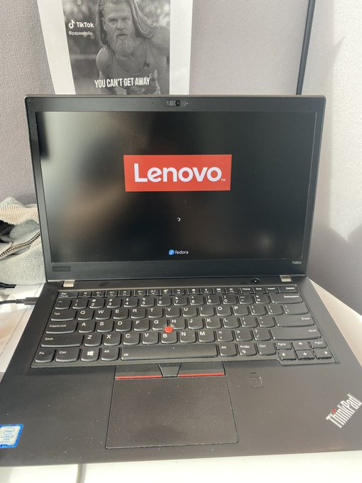
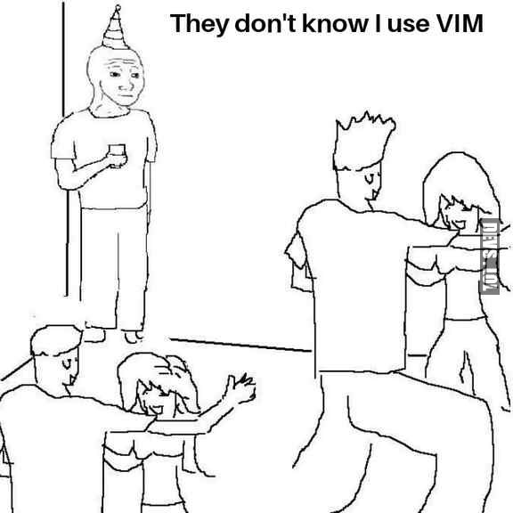

Please come along with me to my personal blog and join me on my technological adventures. Consider this my way of staying connected with technology and attempting to create something different and new to me.

## How did it all begin?

It started with a desire to sharpen my Linux skills. So, like any self-respecting nerd, I did what needed to be done - I bought a second-hand Lenovo Thinkpad (mine's a T480S) and installed Linux on it. Initially, I tried Fedora, which brought back memories of my [academic years](https://carlosrd.dev/about/#academic-education). However, after a brief wrestling match with the [fingerprint sensor](https://gist.github.com/borcean/f32c47f6cc52cee33dfc2265ce63f777) (about five minutes, to be precise), I decided to settle down with [Pop!\_OS](https://pop.system76.com/). That, and the fact that I'm more comfortable with Debian-based distros (apt FTW!).

 

## What am I intending to do?

Now that I have a Linux-running computer, what's next? The logical step, it seems, is to create a personal blog where I can share my [my projects](/projects/) and track my progress. So I started delving into the worlds of Digitalocean VPS, NGINX, Github, Markdown and Hugo. And if that weren't enough, I'm daring to work exclusively using Vim because, well, I like to live dangerously and I might be a bit of a masochist.

## What have I learned so far?

1. The journey began with spinning up a VPS on DigitalOcean, created a Hugo page and hosted it in NGINX. Everything seemed great: the page loaded, certificates ran smoothly, and the mail server was set up. Soon I came across the first “little issue” - outbound emails wouldn’t be sent. A bit of digging revealed that [DigitalOcean blocks SMTP](https://docs.digitalocean.com/support/why-is-smtp-blocked/) to prevent spam .

2. Because of this and my affinity for not paying for things, I decided to ditch the email server and host the webpage on [GitHub instead](https://gohugo.io/hosting-and-deployment/hosting-on-github/). Maybe not as sophisticated but it does the job for now. 
3. Vim's learning curve is steeper than I initially thought. Quickly I learned that, in order to succeed with this task, one needs to map the CapsLock key to Esc to prevent severe left-hand injuries.

## What are the next steps?

1. Work on creating a streamlined system for post creation to minimize resistance, making me more consistent and, therefore, more productive. 
2. Continue tinkering with Hugo and [Bluefish](https://blowfish.page/docs/) to make this site more aesthetically pleasing. My markdown and HTML skills could use some sprucing up. 
3. And as for Vim, I believe (or at least hope) that sticking with it will yield promising results in the future. For now, I’ll play with [VimGenius](http://www.vimgenius.com/) whenever I find a couple of minutes to spare.
4. I have never setup Firebase. I guess the time to change that has come. 

