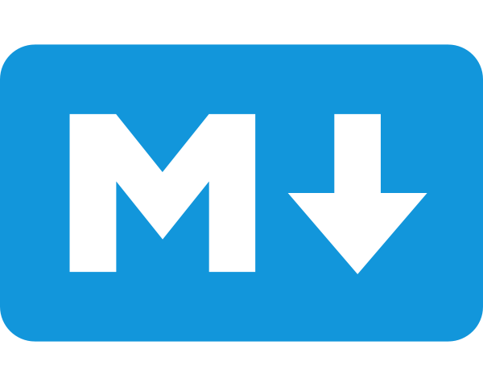
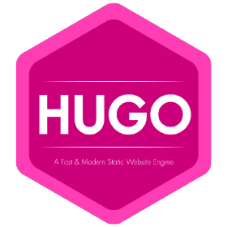
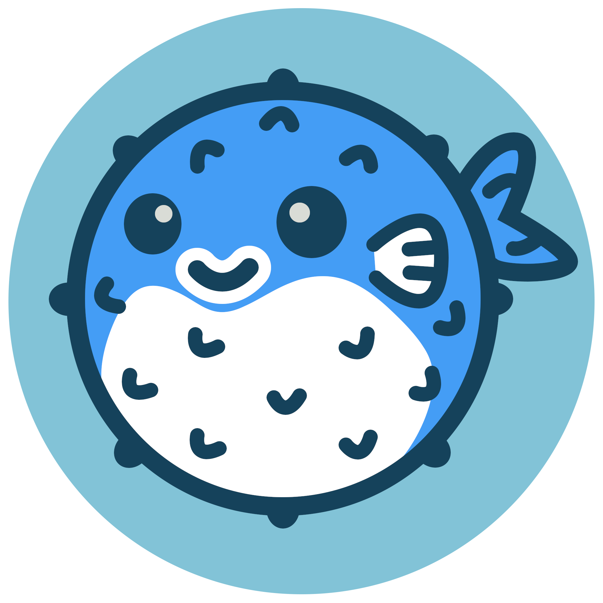
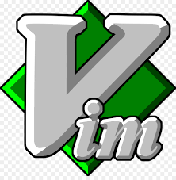

This is a list of technologies and tools I’m currently trying to learn and the reasons why I choose to do so: 

## 2023 

<table>
    <thead>
        <tr>
            <th>Technology</th>
            <th>Website</th>
            <th>Description</th>
        </tr>
    </thead>
    <tbody>
            <tr>
            <td></td>
            <td><a target="_blank" href="https://www.markdownguide.org">Markdown </a></td>
            <td>Markup language to create technical documentation. Will come handy while working on this website and later with Obsidian.</td>
        </tr>
            <tr>
            <td></td>
            <td><a target="_blank" href="https://gohugo.io/">Hugo</a></td>
            <td>The building blocks of this website. Because wordpress is so mainstream....</td>
        </tr>
            <tr>
            <td></td>
            <td><a target="_blank" href="https://github.com/nunocoracao/blowfish">Blowfish</a></td>
            <td>A theme for Hugo that makes this website look the way it does.</td>
        </tr>
            <tr>
            <td></td>
            <td><a target="_blank" href="https://github.com/">Github</a></td>
            <td>Because learning version control and collaborative tools is a good thing for those who work with other human beings. </td>
        </tr>
            <tr>
            <td></td>
            <td><a target="_blank" href="https://www.vim.org/">Vim</a></td>
            <td>Because I want to tell people Vim is my editor of choice. Will I ever quit using the mouse or die trying?.</td>
        </tr>
         <tr>
            <td></td>
            <td><a target="_blank" href="https://obsidian.md/">Obsidian</a></td>
            <td>I plan on taking smart notes to create a second brain that hopefully functions better than mine.</td>
        </tr>
         <tr>
            <td></td>
            <td><a target="_blank" href="https://www.isc2.org/certifications/cissp/">ICS2 CISSP</a></td>
            <td>Hopefully the tools above help me create a system that allows me to obtain the Certified Information Systems Security Professional (CISSP) certification. I guess I will need to find other excuses to continue procrastinating.</td>
        </tr>
    </tbody>
</table>